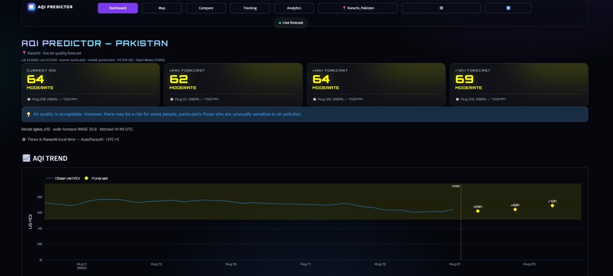
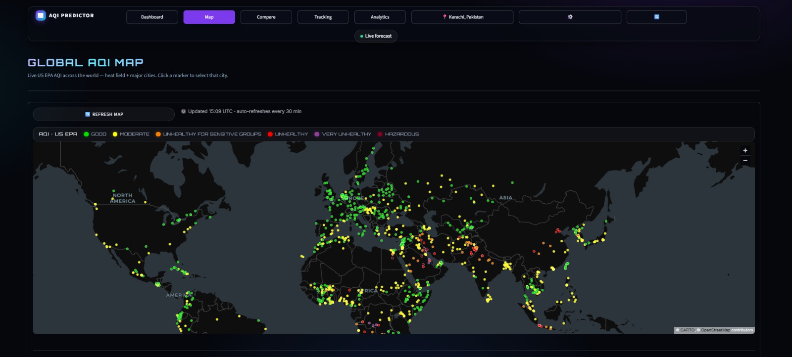
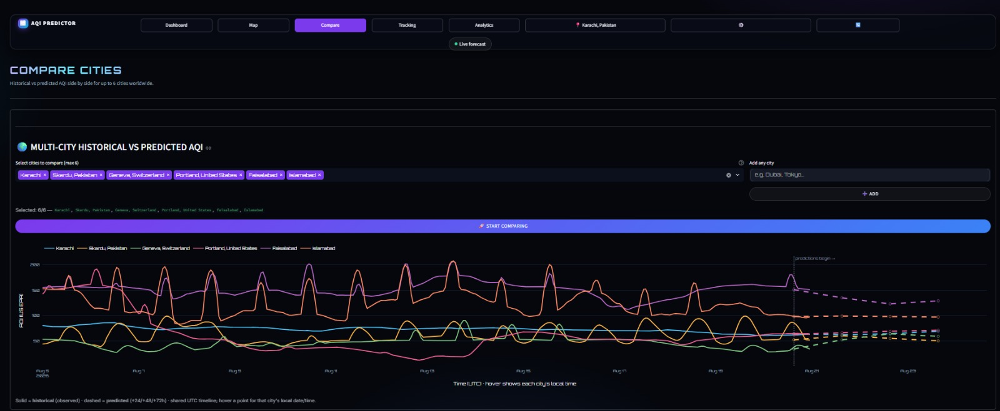
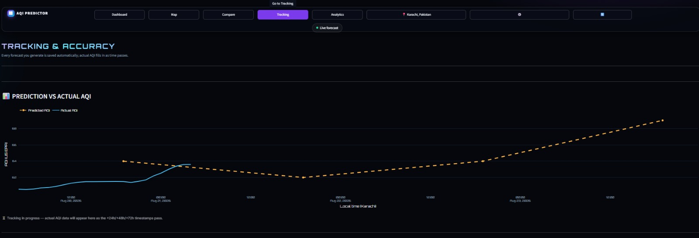
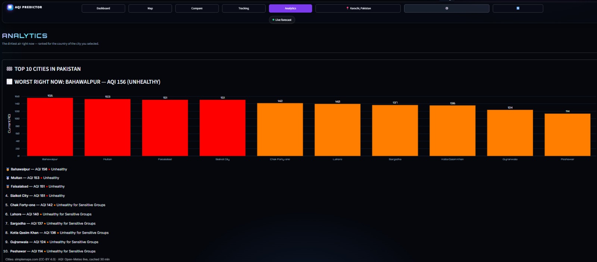
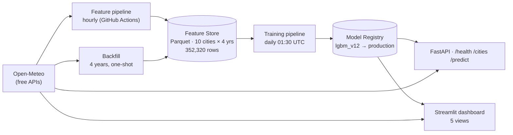

# 🌫️ AQI Predictor — Pakistan

**Multi-horizon air-quality forecasting for any city in Pakistan — live on the web.**

Predict the Air Quality Index (AQI) **24, 48 and 72 hours ahead** for any location,
using a city-agnostic machine-learning model trained on 4 years of data from 10
Pakistani cities, an automated data/training pipeline, and a location-aware dashboard.

> 10Pearls Data Science Internship project · Built in 31 days (27 Jul → 23 Aug 2026)

[](https://aqi-predictor-blii.onrender.com)
[](#testing)
[](docs/FINAL_MODEL_HEALTH_REPORT.md)

---

## Screenshots

### Dashboard


### Map


### Compare


### Tracking


### Analytics


---

## What it does

- **Location-aware**: opens on your city via browser geolocation, falls back to
  IP-based detection, or you can search any city in the world (Open-Meteo geocoding).
- **3-day forecast**: current AQI plus **+24h / +48h / +72h** predictions with EPA
  band labels (Good → Hazardous) and health messages.
- **Explainable**: a SHAP-based natural-language "why" for every forecast.
- **Live leaderboard**: the 10 most-polluted cities right now ("worst city").
- **Global AQI map**: live heat field + city markers, click to select.
- **Track your city**: save predictions and see Prediction-vs-Actual accuracy over time.
- **Compare**: side-by-side multi-city AQI comparison and analytics.
- **REST API** (`FastAPI`): `/health`, `/cities`, `/predict?lat=..&lon=..`.

**Try it:** https://aqi-predictor-blii.onrender.com

---

## Why not just "predict AQI from pollutants"?

Open-Meteo's `us_aqi` is **not independently measured** — it is computed
deterministically from same-hour pollutant concentrations (PM2.5, PM10, CO, NO2, SO2,
O3) using the public EPA breakpoint table. A model that predicts `us_aqi` from those
same readings at the same timestamp scores R² ≈ 0.999 — not machine learning, just
rediscovering a lookup table.

This project predicts AQI **24–72 hours ahead** using only information available at
prediction time:

- **Family A — history**: pollutant lags, rolling statistics, AQI change rate.
- **Family B — future weather at the target hour**: forecast temperature, wind
  speed/direction, humidity, pressure, boundary-layer height, calendar features.

Wind is the most important feature — pollution is emission minus dispersion, and
wind speed *is* dispersion.

---

## Model results (validated on genuinely unseen data)

Production model: **`lgbm_v12`** — LightGBM trained strictly before the 60-day
temporal holdout (337,910 rows). All three pre-declared promotion gates **PASS**:
beats persistence, beats seasonal-naive, and beats the previous production model
(v6 — disqualified because it trained over the holdout window; documented in the
[Final Model Health Report](docs/FINAL_MODEL_HEALTH_REPORT.md)).

### Clean 60-day holdout (14,410 rows, 10 cities)

| Horizon | RMSE | MAE | R² | MAPE | MAE target | ✅ |
|---|---|---|---|---|---|---|
| +24h | **17.6** | 12.5 | 0.77 | 10.3% | ≤ 20 | ✅ |
| +48h | **22.1** | 16.0 | 0.64 | 13.1% | ≤ 25 | ✅ |
| +72h | **22.6** | 16.5 | 0.62 | 13.5% | ≤ 30 | ✅ |

### Unseen city — Sialkot (35,232 rows, never in training)

| Horizon | RMSE | MAE | R² |
|---|---|---|---|
| +24h | 17.4 | **13.5** | 0.82 |
| +48h | 22.7 | **18.0** | 0.70 |
| +72h | 23.7 | **18.9** | 0.68 |

Sialkot proves the model generalizes to a city it has never seen — the evidence for
"works anywhere in Pakistan".

### Performance (live on Render, median of 7 warm runs)

| Endpoint | Median | P95 | Target |
|---|---|---|---|
| `/health` | 0.21s | 0.22s | < 0.5s ✅ |
| `/cities` | 0.21s | 0.26s | < 1s ✅ |
| `/predict` | 0.89s | 1.00s | < 1.5s ✅ |
| Dashboard | 0.38s | 0.50s | < 3s ✅ |

Full details, per-city tables and predicted-vs-actual analysis:
[`docs/FINAL_MODEL_HEALTH_REPORT.md`](docs/FINAL_MODEL_HEALTH_REPORT.md)

---

## Architecture

Five automated parts feed each other — data pipeline → feature store → training →
registry → live serving:



- **Feature pipeline** (hourly): pull trailing window → engineer features → upsert
  into the store.
- **Backfill** (one-shot): seed 2022–2026 history for 10 cities (352,320 rows).
- **Training pipeline** (daily): walk-forward CV → register model → **auto-promote
  only if it beats production** (otherwise candidate).
- **Inference**: any (lat, lon) → same feature builder → production model →
  +24/48/72h forecast.
- **Dashboard + API**: auto-deployed to Render on every push to `main`.

Full detail: [`docs/ARCHITECTURE.md`](docs/ARCHITECTURE.md)

---

## Quick start (local)

Requires Python 3.12.

```bash
git clone https://github.com/AyyanStorm/aqi-predictor.git
cd aqi-predictor
python -m venv .venv && source .venv/bin/activate   # Windows: .venv\Scripts\activate
pip install -r requirements.txt

# 1. One-line forecast for any city:
python -m src.inference.predict --lat 24.8608 --lon 67.0104 --city Karachi

# 2. Run the dashboard:
streamlit run app/streamlit_app.py

# 3. Run the API:
uvicorn app.api:app --port 8000
#    → http://localhost:8000/health · /cities · /predict?lat=24.86&lon=67.01&city=Karachi

# 4. Run the tests:
pytest tests/ -q        # 95 tests, ~20s
```

> **Model artifact note:** the production model (`lgbm_v12`, ~4 MB) is committed in
> `data/models/registry/` so the repo runs out-of-the-box. Retrain with
> `python -m src.training.train --model lgbm --register`.

---

## Data & sources

- **Air quality + weather:** [Open-Meteo](https://open-meteo.com/) (free, no API key):
  air-quality API, archive API (4-year history), forecast API, geocoding API.
- **Cities (training):** Karachi, Lahore, Islamabad, Faisalabad, Rawalpindi, Multan,
  Peshawar, Quetta, Hyderabad, Gujranwala.
- **Unseen-city validation:** Sialkot (fetched separately, never in the store).
- **Store:** 352,320 rows (10 cities × 35,232 hourly rows), 2022-08-06 → 2026-08-15.
- **Caveats** (documented in the health report): `boundary_layer_height` missing
  Jan–Jun 2024 (API gap); 10 extreme AQI rows > 500 kept as-is.

---

## Automation (GitHub Actions)

| Workflow | Schedule | Job |
|---|---|---|
| `feature_pipeline.yml` | hourly | ingest + engineer + upsert store |
| `backfill_pipeline.yml` | manual | one-shot 4-year seed |
| `training_pipeline.yml` | daily 01:30 UTC | train + evaluate + auto-promote |
| `ci.yml` | every push/PR | 95-test gate |

---

## Project structure

```
app/                  Streamlit dashboard (5 views) + FastAPI
src/
  data_ingestion/     Open-Meteo client, hourly ingest, backfill
  features/           build_features, targets, feature_store
  training/           train, evaluate, tune, lstm, model_registry
  inference/          predict (features + model serving)
  tracking/           prediction-vs-actual accuracy
  utils/              aqi bands, geo, local time, explain (SHAP), events
scripts/              audit + benchmark tooling
tests/                95 automated tests
data/models/registry  production model + metadata
docs/                 roadmap, audit plan, QA plan, health report, architecture
render.yaml           Render blueprint (api + dashboard)
```

---

## Documentation

- [`docs/ROADMAP.md`](docs/ROADMAP.md) — 33-day build log (every day ticked ✅)
- [`docs/ARCHITECTURE.md`](docs/ARCHITECTURE.md) — system architecture
- [`docs/FINAL_MODEL_HEALTH_REPORT.md`](docs/FINAL_MODEL_HEALTH_REPORT.md) — data,
  model & performance health + final verdict
- [`docs/AUDIT_PLAN.md`](docs/AUDIT_PLAN.md) — locked validation decisions
- [`docs/QA_TEST_PLAN.md`](docs/QA_TEST_PLAN.md) · [`docs/MANUAL_QA_CHECKLIST.md`](docs/MANUAL_QA_CHECKLIST.md)

---

## Built with

Python · pandas · LightGBM · scikit-learn · Streamlit · FastAPI · Plotly · SHAP ·
PyDeck · GitHub Actions · Render · Open-Meteo · Keras (LSTM baseline)

## License

Internal internship project — © 2026 Ayyan Amir. Not for redistribution.