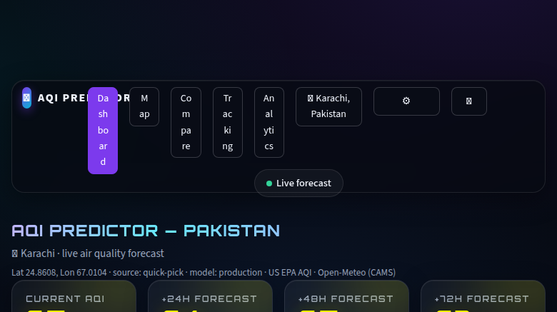
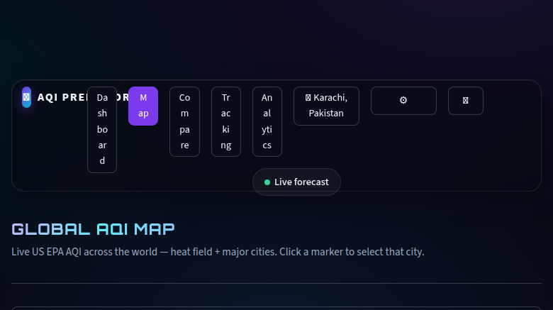
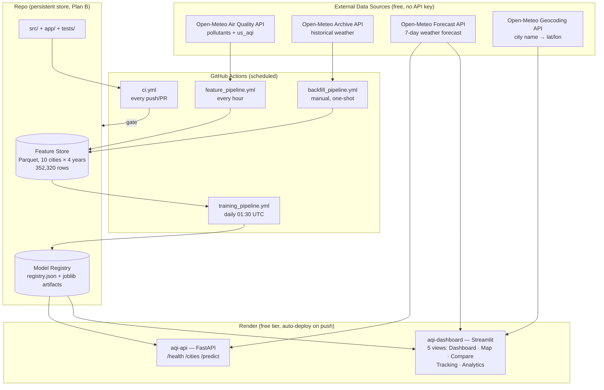

# AQI Predictor — System Architecture

**Last updated:** 18 Aug 2026 (Day 31, pre-demo)
**Live:** https://aqi-predictor-blii.onrender.com · **Repo:** https://github.com/AyyanStorm/aqi-predictor

This document describes the production-shaped ML system built over 31 days for the
10Pearls Data Science Internship: five moving parts that run on a schedule and feed
each other — feature pipeline, historical backfill, training pipeline, inference
pipeline, and a location-aware dashboard.

---

## 1. High-level view

> **Live screenshots (production, serving lgbm_v12):**
> | Dashboard — live forecast | Global AQI map |
> |---|---|
> |  |  |



**Data flow in one sentence:** Open-Meteo feeds the feature store (hourly + one-time
4-year backfill); the daily training pipeline reads the store and registers models;
the dashboard and API load the production model from the registry and combine it with
live + forecast data to answer "what will AQI be in my city in 24/48/72 hours?".

---

## 2. Components

### 2.1 Feature pipeline (every hour — `feature_pipeline.yml`)
- Pulls the trailing 10-day window of pollutants + weather for 10 Pakistani cities
  from Open-Meteo (`src/data_ingestion/hourly_ingest.py`).
- Engineers the same features the model trains on (`src/features/build_features.py`)
  and **upserts** them into the Parquet feature store (`src/features/feature_store.py`).
- Commits the refreshed store back to the repo, so the store persists without any
  external database (Plan B — Hopsworks is deliberately not used; see §6).

### 2.2 Historical backfill (one-shot — `backfill_pipeline.yml`)
- Seeds ~4 years (2022-08-06 → 2026-08-15) of engineered features for all 10 cities:
  **352,320 rows**.
- Serial fetches only — Open-Meteo's archive API rejects concurrent requests (429).
- **Sialkot** is fetched separately (`data/raw/sialkot_engineered.pkl`) and **never**
  enters the training store: it is the unseen-city validation set.

### 2.3 Training pipeline (daily 01:30 UTC — `training_pipeline.yml`)
- Reads the full feature store, trains LightGBM multi-horizon models
  (+24h/+48h/+72h targets, `src/features/targets.py`), evaluates with walk-forward CV
  (`src/training/evaluate.py`, `tune.py`), and registers the artifact with metadata
  (`src/training/model_registry.py`).
- **Auto-promotion guard (Day 14 contract):** a new version only becomes production
  if its mean RMSE beats the current production model's; otherwise it is registered
  as a candidate and never served.
- Commits the registry back to the repo (GITHUB_TOKEN pushes don't re-trigger workflows).

### 2.4 Inference pipeline (`src/inference/predict.py`)
- Input: any (lat, lon) on Earth + optional city label.
- Builds the **exact same feature vector** the model saw in training — history
  (pollutant lags, rolling stats, AQI change rate) plus **future weather at the target
  timestamp** (legitimately known at prediction time from the forecast API).
- Loads the production model from the registry and returns current AQI +
  +24h/+48h/+72h forecasts.

### 2.5 Model Registry (`src/training/model_registry.py`)
- Single source of truth: `data/models/registry/registry.json` + joblib artifacts.
- Every version stores: artifact, feature columns, hyperparameters, train window,
  per-horizon metrics, status (`candidate` / `production` / `archived`), promotion
  history. Rollback is a pointer change, not a file delete.
- **Current production: `lgbm_v12`** (clean candidate, trained strictly before the
  60-day holdout). CI's overlapping refits are kept as candidates (v13) or archived
  (v11) — never promoted.

### 2.6 Serving layer (Render)
- **aqi-api** (FastAPI, `app/api.py`):
  - `GET /health` — service + production model status
  - `GET /cities` — the 10 training cities
  - `GET /predict?lat=..&lon=..&city=..` — 3-day AQI forecast with EPA band labels
    and health messages
- **aqi-dashboard** (Streamlit, `app/streamlit_app.py`) — five views:
  - **Dashboard** — location picker (GPS/IP/search), current AQI, +24/48/72h forecast
    cards, AQI trend chart, SHAP "why" explanation, hazard alerts, top-10 leaderboard
  - **Map** — global live AQI heat field + city markers (rate-limit strategy: 6h TTL
    heat grid, markers-first render)
  - **Compare** — multi-city side-by-side comparison
  - **Tracking** — "Track my city": save predictions, then Prediction-vs-Actual chart
    and average accuracy
  - **Analytics** — historical analytics
- Both services auto-deploy from `main` (`render.yaml`, `autoDeploy: true`).

---

## 3. The core modeling decision (no leakage)

Open-Meteo's `us_aqi` is computed deterministically from same-hour pollutant readings
using the EPA breakpoint table. Predicting `us_aqi` from those same readings is
therefore trivial (R² ≈ 0.999) and useless. This project instead frames the problem as:

> Given everything observable at time **t**, predict `us_aqi` at **t+24h, t+48h, t+72h**.

Feature families (all answerable with "yes, I would know this at the moment I press Predict"):
- **Family A — history:** current pollutants + AQI; lags (1h, 3h, 6h, 12h, 24h, 48h, 168h);
  rolling 24h/72h/7-day stats; AQI change rate (t − t−24h).
- **Family B — future weather at the target timestamp:** forecast temperature, wind
  speed/direction, humidity, precipitation, pressure, boundary-layer height, plus
  calendar features (hour, day-of-week, month, is_weekend).

Wind is the single most important non-pollutant feature — pollution is emission minus
dispersion, and wind speed *is* dispersion.

---

## 4. Validation strategy (proving it generalizes)

- **Clean temporal holdout:** the last 60 days (2026-06-13 → 08-12, 14,410 rows) are
  never seen by the winning candidate (trained on 337,910 rows strictly before it).
- **Unseen-city holdout:** Sialkot — in no training fold, never in the store.
- **Pre-declared gates (locked in `docs/AUDIT_PLAN.md`):** beat persistence,
  beat seasonal-naive, beat the incumbent (v6 — disqualified because it trained over
  the holdout window and memorized ~54/60 days; its holdout numbers are documented
  but not treated as a fair baseline).
- **All gates PASS for v12** — full numbers in `docs/FINAL_MODEL_HEALTH_REPORT.md`.

---

## 5. QA, testing & performance

- **Tests:** 95 automated tests (`tests/`, run by CI on every push) covering features,
  inference, API, app smoke, map, accuracy tracking, country picker, local time.
- **QA plan:** `docs/QA_TEST_PLAN.md` (automated ✅ / manual 👁) + `docs/MANUAL_QA_CHECKLIST.md`.
- **Audit scripts:** `scripts/audit/` (data audit, model audit, model selection,
  final-candidate eval, artifact revalidation).
- **Benchmarks:** `scripts/benchmark/` — before/after on the SAME deployed code
  (median + P95, multi-run; cold start excluded). All targets met:
  `/health` 0.21s · `/cities` 0.21s · `/predict` 0.89s · dashboard 0.38s (medians).

---

## 6. Design decisions & trade-offs

| Decision | Choice | Why |
|---|---|---|
| Feature store | Parquet in repo (Plan B) | Hopsworks pins protobuf<5/pandas<2.4 → conflicts with keras + pandas 3.x; repo-as-store is free, transparent, and CI-committable |
| Model family | LightGBM | Walk-forward winner (mean RMSE 24.3 vs ridge 25.6, persistence 29.0, seasonal 36.7); LSTM kept as baseline comparison |
| Global city-agnostic model | No city ID in features | Trained on 10 cities' atmospheric dynamics → generalizes to any coordinates (proven by Sialkot) |
| Deployment | Render blueprint, 2 services, auto-deploy | Free tier, one-push deploy, HTTPS for geolocation |
| Staged deploy | Freeze → Stage 1 API → Stage 2 model swap | Locked in AUDIT_PLAN Q7; before/after measured on identical code |
| Scheduled automation | 4 GitHub Actions workflows | Hourly ingest, daily training, CI gate, one-shot backfill |

---

## 7. Repo layout (top level)

```
app/                  Streamlit dashboard (5 views) + FastAPI
src/
  data_ingestion/     Open-Meteo client, hourly ingest, backfill
  features/           build_features, targets, feature_store
  training/           train, evaluate, tune, lstm, model_registry
  inference/          predict (feature building + model serving)
  tracking/           prediction-vs-actual accuracy store
  utils/              aqi bands, geo, local time, explain (SHAP), events, logger
scripts/
  audit/              data/model audit + selection scripts
  benchmark/          before/after latency benchmarks
tests/                95 automated tests (CI)
data/models/registry  registry.json + model artifacts (production: lgbm_v12)
docs/                 ROADMAP, AUDIT_PLAN, QA_TEST_PLAN, FINAL_MODEL_HEALTH_REPORT
.github/workflows/    feature, backfill, training, CI
render.yaml           Render blueprint (api + dashboard)
```
