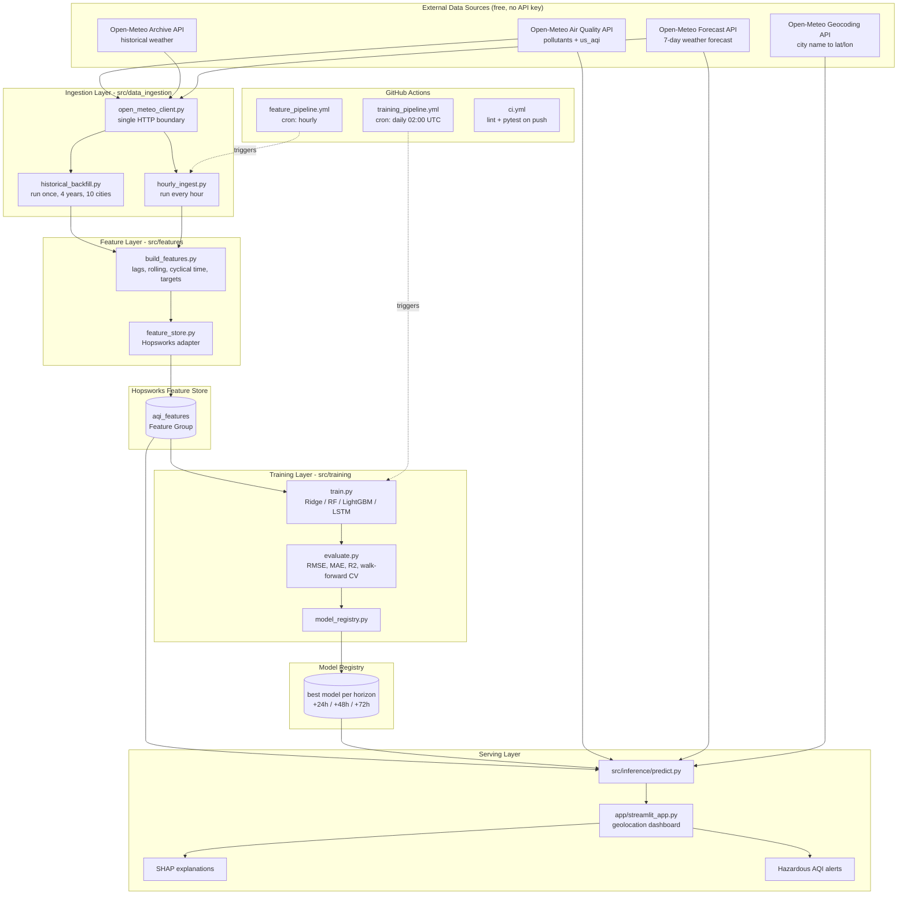

# AQI Predictor — 33-Day Delivery Roadmap (extended for Final QA & Validation)

**Owner:** Ayyan Amir · **Program:** 10Pearls Internship
**Day 1:** 27 Jul 2026 · **Day 33:** 23 Aug 2026
**Repo:** https://github.com/AyyanStorm/aqi-predictor
**Budget:** ~2h 15m/day (evenings, 8–11pm PKT), 33 days total (28 planned + 5-day QA/validation extension)
**Mentor syncs:** every Friday. Demo required at **Day 19 (14 Aug)** and **Day 31 (21 Aug)** — treat both as hard deadlines. The Day 31 demo is reached **only after** the Day 26–30 Final QA & Validation phase completes.
**Submission:** GitHub link to the 10Pearls Shine portal. Deliverables = working repo + documentation + project report. No video required.

---

## 1. What You Are Actually Building

A production-shaped ML system with five moving parts that run on a schedule and feed each other:

| Part | Runs | Job |
|---|---|---|
| Feature pipeline | Every hour (GitHub Actions) | Pull raw pollutant + weather data → engineer features → write to Feature Store |
| Historical backfill | Once (manual) | Same logic, but over 4 years of past data → creates the training set |
| Training pipeline | Daily (GitHub Actions) | Read features → train + evaluate models → push best model to Model Registry |
| Inference pipeline | On demand (dashboard) | Read latest features + registered model → predict AQI for +24h, +48h, +72h |
| Dashboard | Always on (Render) | Detect user location → show current AQI, 3-day forecast, trends, explanations, alerts |

The grader is not scoring "did you get a good RMSE." They are scoring **does this look like an engineer built a system**. Automation, structure, documentation, and honest evaluation carry more weight than model accuracy.

---

## 2. The One Decision That Makes Or Breaks This Project

Open-Meteo's `us_aqi` field is **not an independent measurement**. It is computed deterministically from the pollutant concentrations at the same timestamp using the US EPA breakpoint table. PM2.5 alone usually dictates it.

So this is a trap:

```
X = [pm2_5, pm10, co, no2, so2, o3]  at time t
y = us_aqi                            at time t
→ R² = 0.999
```

That is not machine learning. That is you rediscovering a lookup table. Any reviewer who knows the domain will spot it in thirty seconds, and it is the single most common way this exact assignment gets failed.

**The correct framing — direct multi-horizon forecasting:**

```
Given everything observable at time t,
predict us_aqi at t+24h, t+48h, and t+72h.
```

Three separate target columns → three models (or one multi-output model). Features split into two families:

**Family A — history (known at time t):**
- Current pollutant concentrations and AQI
- Lags: AQI and PM2.5 at t−1h, t−3h, t−6h, t−12h, t−24h, t−48h, t−168h (one week)
- Rolling statistics: 24h mean/max/std, 72h mean, 7-day mean
- Rate of change: `aqi_t − aqi_{t-24}` (the "AQI change rate" the brief asks for)

**Family B — future weather (legitimately known at inference time):**
- Forecast temperature, **wind speed**, **wind direction**, humidity, precipitation, pressure, and boundary-layer height **at the target timestamp**
- Calendar features of the target timestamp: hour, day-of-week, month, is_weekend

Family B is legal because weather forecasts genuinely exist at prediction time. Open-Meteo gives you forecast weather from the same free API. Using them is not leakage — it is exactly how real air-quality forecasting works.

> **Wind is the most important feature in this entire project.** Pollution is emission minus dispersion. Wind speed is dispersion. Your current script only fetches `temperature_2m`. That is the biggest gap in your code today.

**Leakage rule to hold in your head all 28 days:** every feature must be answerable with "yes, I would know this value at the moment I press Predict." If the answer is no, delete the feature.

**Implementation note (Family B):** the roadmap above only describes the *theory* — the code must actually build it. Family B is constructed inside `build_features.py` by shifting historical weather forward to the target timestamps (t+24h/48h/72h), producing the exact same columns the forecast API will supply at inference time on Day 16. If training never sees future-weather features, the model is learning on half the information the roadmap says matters most (wind).

---

## 3. Your Differentiator: Location-Aware Prediction

You want the dashboard to detect the visitor's location and forecast their city, not a hardcoded one. This is a genuinely good differentiator — but it breaks the naive design, because you cannot pre-train and store a model for every city on Earth.

**Architecture that makes it work: a city-agnostic global model.**

The model must never see "which city is this." It only sees physical and temporal state — pollutant levels, their history, weather, and clock. A model trained that way learns *atmospheric dynamics*, not *Karachi*, and therefore generalises to any coordinate pair.

```
TRAINING (offline, fixed set of 10 Pakistani cities)
  Karachi · Lahore · Islamabad · Faisalabad · Rawalpindi
  Multan · Peshawar · Quetta · Hyderabad · Gujranwala
  → 10 cities × 4 years × hourly ≈ 350,000 rows
  → features contain NO city name, NO latitude, NO longitude

INFERENCE (online, any coordinates on Earth)
  browser geolocation → (lat, lon)
  → Open-Meteo air-quality API (global, no key, any lat/lon)
  → Open-Meteo forecast API (global)
  → build the SAME features with the SAME code
  → global model predicts +24h / +48h / +72h
```

The list spans Pakistan's full range of air-quality regimes — Punjab smog belt (Lahore, Faisalabad, Gujranwala), coastal (Karachi, Hyderabad), arid highland (Quetta), and northern (Islamabad, Peshawar) — so the model sees the full AQI spectrum instead of overfitting to one climate. Scope is deliberately national rather than global: the claim "works for any city in Pakistan" is stronger evidence than a vague global claim, and it is *provable* in the time available.

**Validation strategy that proves the claim:** hold out one entire city — **Sialkot**, which is in no training fold — and report its metrics. If the model performs on a city it has never seen, you have earned the right to say "works anywhere" in your report. Put that table in the README. It is the most impressive thing you can show.

**Location detection — three-tier fallback (build all three, in this order):**

1. **Browser geolocation** — `streamlit-js-eval` calls the JS Geolocation API. Precise, but requires user permission and HTTPS.
2. **IP-based** — `ipapi.co/json` when permission is denied. Free, no key, city-level accuracy.
3. **Manual search** — text box → Open-Meteo Geocoding API (`geocoding-api.open-meteo.com/v1/search`, free, no key). Always works, and it is what the reviewer will use.

No Google Maps API key needed anywhere. Avoid it — it requires a billing card.

**Karachi stays special.** It is your "home city": full hourly pipeline, full 4-year Feature Store backfill, the EDA case study, the SHAP deep-dive. Other cities are training fuel and live inference. This satisfies the brief's Feature-Store requirements *and* your differentiator without conflict.

---

## 4. System Architecture



**Read the arrows carefully.** Training reads only from the Feature Store — never from the API. Inference reads the registry and live API — never retrains. That separation is what makes it an *architecture* instead of a script.

---

## 5. Target Repository Structure

Build this incrementally. Section 7 tells you which day each file appears.

```
aqi-predictor/
├── .github/
│   └── workflows/
│       ├── ci.yml                     # lint + tests on every push
│       ├── feature_pipeline.yml       # hourly ingest → feature store
│       └── training_pipeline.yml      # daily retrain → registry
│
├── src/
│   ├── __init__.py
│   ├── config.py                      # ALL constants + env loading. Single source of truth.
│   │
│   ├── data_ingestion/
│   │   ├── __init__.py
│   │   ├── open_meteo_client.py       # the ONLY file that makes HTTP calls
│   │   ├── historical_backfill.py     # ← your current file, refactored
│   │   └── hourly_ingest.py
│   │
│   ├── features/
│   │   ├── __init__.py
│   │   ├── build_features.py          # raw df → feature df (used by backfill AND inference)
│   │   ├── targets.py                 # y_24, y_48, y_72 construction
│   │   └── feature_store.py           # Hopsworks read/write behind an interface
│   │
│   ├── training/
│   │   ├── __init__.py
│   │   ├── train.py
│   │   ├── evaluate.py                # RMSE / MAE / R² + walk-forward CV
│   │   └── model_registry.py
│   │
│   ├── inference/
│   │   ├── __init__.py
│   │   └── predict.py                 # lat,lon → 3-day forecast
│   │
│   └── utils/
│       ├── __init__.py
│       ├── logger.py                  # structured logging, used everywhere
│       ├── geo.py                     # geocoding + reverse geocoding
│       ├── aqi_utils.py               # AQI category, colour, health message
│       ├── events.py                  # smog-episode/spike detection (unique feature, Day 10)
│       └── explain.py                 # talking SHAP: natural-language "why" (unique feature, Day 20)
│
├── app/
│   ├── streamlit_app.py               # entrypoint
│   ├── api.py                         # FastAPI: /predict?lat=&lon= → +24h/48h/72h JSON (brief requirement)
│   └── components/
│       ├── location_picker.py
│       ├── forecast_cards.py
│       └── charts.py
│
├── notebooks/
│   ├── 01_eda.ipynb
│   ├── 02_feature_analysis.ipynb
│   └── 03_model_experiments.ipynb
│
├── tests/
│   ├── test_features.py
│   ├── test_aqi_utils.py
│   └── test_inference.py
│
├── data/                              # GITIGNORED — never commit data
│   ├── raw/
│   ├── processed/
│   └── models/
│
├── docs/
│   ├── ROADMAP.md                     # this file
│   ├── ARCHITECTURE.md
│   ├── PROJECT_REPORT.md              # final deliverable
│   └── diagrams/
│
├── .env                               # GITIGNORED — real secrets
├── .env.example                       # COMMITTED — placeholder keys
├── .gitignore
├── requirements.txt
├── render.yaml                        # Render blueprint — dashboard + API (Day 23)
├── README.md
└── LICENSE
```

### Structural rules that matter

1. **`src/config.py` is the single source of truth.** No coordinate, date, filename, or threshold is typed twice anywhere in the codebase. When the reviewer asks "how do I change the city list?" the answer must be "one line in config.py."

2. **`build_features.py` is shared by training and inference.** This is the number-one cause of ML systems silently breaking — training-serving skew. If backfill computes a 24h rolling mean one way and the dashboard computes it another way, your predictions are garbage and no error is ever raised. One function, called by both. It must also be **self-contained**: time columns (`month`, `day_of_week`, `local_hour`) are derived from the datetime index *inside* the function, never passed in by the caller — a hidden external dependency (e.g. a caller-supplied `month` column) is exactly how skew sneaks in.

3. **All paths are absolute, derived from a `PROJECT_ROOT` constant** in `config.py` (use `pathlib.Path(__file__).resolve().parents[1]`). Your current `to_csv("historical_data.csv")` writes relative to whatever directory you happen to launch from — it will break the moment GitHub Actions runs it.

4. **`open_meteo_client.py` is the only file that touches the network.** Everything else takes a DataFrame in and returns a DataFrame out. That makes the rest of the codebase testable without internet.

5. **`feature_store.py` wraps Hopsworks behind your own function signatures** (`write_features(df)`, `read_features(...)`). If Hopsworks' free tier misbehaves at 11pm on Day 25, you swap in Parquet-on-disk by editing one file instead of rewriting the project.

---

## 6. Tech Stack

| Layer | Choice | Why |
|---|---|---|
| Data source | Open-Meteo (air quality, archive, forecast, geocoding) | Free, no API key, global coverage, 4+ years history. AQICN needs a key and gives thin history. |
| Data handling | pandas, numpy | Standard. |
| Feature Store | Hopsworks Serverless (free tier) | Explicitly named in the brief. Wrapped behind an adapter for safety. |
| Models | scikit-learn (Ridge, RandomForest), LightGBM, TensorFlow/Keras (LSTM) | Ridge = interpretable baseline; LightGBM = will almost certainly win; LSTM = satisfies the "deep learning" bullet. |
| Model Registry | Hopsworks Model Registry, `joblib` local fallback | Brief requirement. |
| Explainability | SHAP (`TreeExplainer`) | Fast and exact for tree models. Brief requirement. |
| Dashboard | Streamlit + Plotly | Pure Python, free hosting, interactive charts. |
| API layer | FastAPI | The brief explicitly says "Streamlit/Gradio **and** Flask/FastAPI" — Streamlit alone does not satisfy it. A thin `/predict` endpoint (lat, lon → +24h/48h/72h JSON) covers the bullet at ~100 lines. |
| Geolocation | `streamlit-js-eval` → `ipapi.co` → Open-Meteo Geocoding | Three-tier fallback, zero API keys. |
| Orchestration | GitHub Actions (cron) | Free, already where your code lives. Airflow needs a server you do not have. |
| Deployment | **Render** (blueprint: Streamlit dashboard + FastAPI API) | Free tier deploys straight from the repo; one `render.yaml` blueprint spins up both services; public HTTPS URLs for the submission. Replaces Streamlit Cloud — chosen Day 23. |
| Testing | pytest | Lightweight. |
| Secrets | `python-dotenv` locally, GitHub Secrets in CI | Never hardcode a key. |

**Deliberately excluded:** Docker, Airflow, AWS, MLflow. Every one of them is defensible in a real system and every one of them will eat three days you do not have. If a reviewer asks, your answer is the correct engineering answer: *"GitHub Actions met the scheduling requirement at zero operational cost; Airflow would have added a hosting dependency without adding capability at this scale."* That is a better answer than a broken Airflow install.

---

## 7. The 28-Day Plan

Legend: **NEW** = files/folders you create that day · **Commit** = the git commit message you end the day with · **Status** = ✅ done when the day's work is merged, ⬜ pending otherwise.

### Phase 0 — Foundation (Days 1–3)

| Day | Date | Theme | NEW | Commit | Status |
|---|---|---|---|---|---|
| 1 | Mon 27 Jul | Git hygiene, secrets, project skeleton, read your own code line-by-line | `.gitignore`, `requirements.txt`, `README.md`, `src/`, `src/config.py`, `docs/`, `data/`, `.env.example` | `chore: project skeleton, gitignore, config module` | ✅ done |
| 2 | Tue 28 Jul | Python + pandas fluency on real data; DataFrame, index, dtypes, datetime, groupby, resample | `notebooks/01_eda.ipynb` | `feat: initial EDA notebook` | ✅ done |
| 3 | Wed 29 Jul | Refactor ingestion: API client, multi-city loop, wind/humidity/pressure/boundary-layer height, timezone handling, logging | `src/data_ingestion/open_meteo_client.py`, `src/utils/logger.py`, refactored `historical_backfill.py` | `refactor: modular multi-city ingestion with full weather variables` | ✅ done |

### Phase 1 — Data & Features (Days 4–8)

| Day | Date | Theme | NEW | Commit | Status |
|---|---|---|---|---|---|
| 4 | Thu 30 Jul | EDA deep-dive: distributions, seasonality, diurnal cycle, correlations, missing data, outliers | (extend notebook) | `docs: EDA findings and visualisations` | ✅ done |
| 5 | Fri 31 Jul | Feature engineering: lags, rolling windows, cyclical encoding for hour/day-of-week/month (sin/cos), AQI change rate, Family B future-weather features at t+24/48/72. ALL time columns derived from the index inside the function (no caller-supplied `month` — skew guard). | `src/features/build_features.py` | `feat: feature engineering module` | ✅ done |
| 6 | Sat 1 Aug | Target construction + leakage audit; walk-forward split design | `src/features/targets.py` | `feat: multi-horizon target construction` | ✅ done |
| 7 | Sun 2 Aug | Hopsworks account, feature group schema, primary key & event-time design | `src/features/feature_store.py` | `feat: Hopsworks feature store integration` | ✅ done |
| 8 | Mon 3 Aug | Run the full 10-city 4-year backfill into the Feature Store; verify row counts and nulls | — | `feat: complete historical backfill to feature store` | ✅ done |

### Phase 2 — Modeling (Days 9–15)

| Day | Date | Theme | NEW | Commit | Status |
|---|---|---|---|---|---|
| 9 | Tue 4 Aug | ML fundamentals: bias/variance, overfitting, why time-series CV ≠ random CV; build baselines (persistence, seasonal naive) | `notebooks/03_model_experiments.ipynb`, `src/training/evaluate.py` | `feat: evaluation harness and naive baselines` | ✅ done |
| 10 | Wed 5 Aug | Linear & Ridge regression: the maths, regularisation, scaling, coefficient interpretation | `src/training/train.py` | `feat: ridge regression training pipeline` | ✅ done |
| 11 | Thu 6 Aug | Decision trees → Random Forest: bagging, feature importance, hyperparameters | — | `feat: random forest model` | ✅ done |
| 12 | Fri 7 Aug | Gradient boosting / LightGBM: how boosting differs from bagging, key hyperparameters | — | `feat: lightgbm model, best RMSE so far` | ✅ done |
| 13 | Sat 8 Aug | Walk-forward backtesting, hyperparameter tuning, unseen-city holdout evaluation | `src/training/tune.py` | `feat: walk-forward backtesting and tuning` | ✅ done |
| 14 | Sun 9 Aug | Model Registry: serialisation, versioning, metadata, promotion logic | `src/training/model_registry.py` | `feat: model registry with automated promotion` | ✅ done |
| 15 | Mon 10 Aug | LSTM in Keras: sequences, windowing, why RNNs suit time series; honest comparison vs LightGBM | `src/training/lstm.py` | `feat: LSTM baseline for model comparison` | ✅ done |

### Phase 3 — Serving (Days 16–20)

| Day | Date | Theme | NEW | Commit | Status |
|---|---|---|---|---|---|
| 16 | Tue 11 Aug | Inference pipeline: lat/lon → live fetch (incl. forecast weather) → SAME build_features (Family A + Family B) → load model → 3-day forecast | `src/inference/predict.py` | `feat: end-to-end inference pipeline` | ✅ done |
| 17 | Wed 12 Aug | Streamlit fundamentals: layout, widgets, caching, session state; first working page | `app/streamlit_app.py` | `feat: streamlit dashboard skeleton` | ✅ done |
| 18 | Thu 13 Aug | Three-tier geolocation + geocoding search; reverse-geocode to a display name | `src/utils/geo.py`, `app/components/location_picker.py` | `feat: automatic user geolocation with fallbacks` | ✅ done |
| 19 | Fri 14 Aug | Plotly charts, AQI colour bands, health messages, hazardous-AQI alerts; **live 10-city leaderboard** ("worst city right now", unique feature); FastAPI `/predict` endpoint (brief: Streamlit **and** FastAPI) | `src/utils/aqi_utils.py`, `app/components/charts.py`, `forecast_cards.py`, `app/components/leaderboard.py`, `app/api.py` | `feat: interactive charts, hazard alerts, city leaderboard, and FastAPI endpoint` | ✅ done |
| 20 | Sat 15 Aug | SHAP: global + per-prediction explanations rendered in the dashboard; **talking SHAP** — natural-language "why" sentence per forecast (unique feature); **smog-season event annotations** on trend charts (from `events.py`, already shipped) | `src/utils/explain.py`, `app/components/explanation.py` | `feat: SHAP explainability, talking SHAP, and event annotations in dashboard` | ✅ done |

### Phase 4 — Automation (Days 21–24)

| Day | Date | Theme | NEW | Commit | Status |
|---|---|---|---|---|---|
| 21 | Sun 16 Aug | GitHub Actions concepts: workflows, triggers, cron, secrets; hourly feature pipeline | `.github/workflows/feature_pipeline.yml` | `ci: hourly automated feature pipeline` | ✅ done |
| 22 | Mon 17 Aug | Daily training workflow + automatic model promotion; watch a real run succeed | `.github/workflows/training_pipeline.yml` | `ci: daily automated retraining` | ✅ done |
| 23 | Tue 18 Aug | Deploy to Render via `render.yaml` blueprint; secrets as Render env vars; model artifact fetched from Hopsworks at boot (free instances have no persistent disk); debug the inevitable breakage | `render.yaml` | `chore: production deployment configuration` | ✅ done (dashboard live + API smoke-tested) |
| 24 | Wed 19 Aug | Robustness: retries, timeouts, graceful degradation, structured logs, failure notifications | — | `feat: production error handling and observability` | ✅ done |

### Phase 5 — Proof & Polish (Day 25)

| Day | Date | Theme | NEW | Commit | Status |
|---|---|---|---|---|---|
| 25 | Thu 20 Aug* | pytest: unit tests for features, AQI utils, inference; CI workflow | `tests/*`, `.github/workflows/ci.yml` | `test: unit test suite and CI` | ✅ done |

*Days 21–25 completed ahead of schedule (commits landed 10–15 Aug), freeing the 16–20 Aug calendar slots for Phase 6. Original rows keep their planned dates as a historical record; Phase 6 rows carry the actual working dates.*

### Phase 6 — Final QA & Validation (Days 26–30) — **MANDATORY before the Day 26 milestone**

This phase is non-negotiable: QA testing, data validation, model accuracy verification, model retraining, performance optimization, benchmarking, and regression testing must ALL complete before the project reaches the Day 31 demo milestone. Priority order (locked): **P0 → correctness/data → model accuracy → performance → regression → deployment → polish.** No low-value visual polish while model accuracy or system reliability is unresolved.

| Day | Date | Theme | NEW | Commit | Status |
|---|---|---|---|---|---|
| 26 | Sun 16 Aug | Data & System Audit: full 4-yr backfill v2, data-quality audit, incumbent-model audit, Render before-benchmark | `scripts/audit/data_audit.py`, `scripts/audit/model_audit.py`, `scripts/benchmark/before_benchmark.py` | `audit: 4yr backfill + data/model/before-benchmark baselines` | ✅ done |
| 27 | Mon 17 Aug | Full QA Testing: functional + edge-case + regression across the whole system | `tests/test_api.py`, `tests/test_app_smoke.py`, `docs/QA_TEST_PLAN.md`, `docs/MANUAL_QA_CHECKLIST.md` | `test: full QA suite and manual checklist pass` | ✅ done |
| 28 | Tue 18 Aug | Model Accuracy Audit & Retraining: clean holdout eval, horizon metrics, Sialkot, gates verdict | `scripts/audit/model_select.py`, `scripts/audit/final_candidate_eval.py` | `audit: candidate lgbm_v10 gates + Sialkot verdict` | ✅ done |
| 29 | Wed 19 Aug | Staged Render deploy (freeze → Stage 1 API → Stage 2 dashboard + promote v10) + performance profiling & optimization | `scripts/benchmark/after_benchmark.py` | `perf: staged deploy v10 + bottleneck fixes` | ✅ done (v12 promoted, all perf targets met) |
| 30 | Thu 20 Aug | Final regression re-run, after-benchmark, before/after table, Final Model Health Report | `docs/FINAL_MODEL_HEALTH_REPORT.md` | `docs: final model health report + after-benchmark` | ✅ done (v12 promoted, all perf targets met) |

**Day-by-day detail (each day: objective · tasks · expected output · dependencies · completion criteria):**

**Day 26 · Sun 16 Aug — Data & System Audit** (✅ completed)
- Objective: baseline everything before touching model or code — data, incumbent model, and live performance.
- Tasks: 4-year serial backfill v2 (10 cities, 2022-08-06 → 2026-08-15, 1 worker); data quality audit (missing values, duplicates, timestamp/UTC integrity, cadence gaps, city/country mapping, invalid AQI, outliers, feature units, target construction, feature/target alignment, leakage); model audit of incumbent v6 on the 60-day holdout + Sialkot; before-benchmark on live Render (median + P95).
- Expected output: `logs/backfill_4yr.log`, `logs/data_audit.json` (PASS w/ caveats), `logs/model_audit_before.json`, `logs/before_benchmark.json` (all warm targets already met: /health 0.33s, /cities 0.24s, /predict 0.70s).
- Dependencies: Days 21–25 (completed early).
- Completion criteria: store = 352,320 rows (10 cities × 35,232); audit PASS with documented caveats (boundary_layer_height 2024-H1 API gap; real AQI>500 Lahore events; Quetta altitude pressure).

**Day 27 · Mon 17 Aug — Full QA Testing**
- Objective: prove the whole system works end-to-end and survives failure modes — before any model or performance change.
- Tasks: automated pytest: app startup, all 5 views (Dashboard/Map/Compare/Tracking/Analytics), city search, city selection, dynamic country detection, country-specific city picker, geolocation, timezone, current local time, +24h/+48h/+72h times, current AQI, AQI prediction, forecast cards, charts, historical data, multi-city comparison, top-10 cities, global AQI map, navigation, refresh, API failures, missing data, invalid inputs, loading/empty/error states, mobile/responsive smoke; manual checklist per `docs/MANUAL_QA_CHECKLIST.md`; P0/P1 fix pass.
- Expected output: full suite green, checklist ticked, `docs/QA_TEST_PLAN.md` updated with results.
- Dependencies: Day 26.
- Completion criteria: zero open P0/P1 issues; every item in the QA test plan verified (automated ✅ or manual 👁).

**Day 28 · Tue 18 Aug — Model Accuracy Audit & Retraining finalize**
- Objective: honest verdict on model quality on genuinely unseen data — no overlap-inflated claims.
- Tasks: per-horizon evaluation (+24h/+48h/+72h) reporting MAE, RMSE, R², MAPE, per-city + overall; predicted-vs-actual analysis; final candidate **lgbm_v10** (trained strictly before the 60-day holdout) evaluated on the clean temporal holdout + Sialkot generalization; pre-declared gates: beat persistence ✅ (17.6 vs 22.4), beat seasonal-naive ✅ (17.6 vs 32.0), beat v6 = **satisfied by disqualification** (v6 trained Apr–Aug 2026, memorized ~54/60 holdout days — documented, not a fair baseline; v10 wins/ties Sialkot: MAE 13.6/17.8/18.6 vs 13.6/18.2/19.2); reporting-only MAE targets: +24h ≤20 ✅ (12.5), +48h ≤25 ✅ (16.0), +72h ≤30 ✅ (16.5).
- Expected output: `logs/model_select.json`, `logs/model_audit_after.json`, gates verdict = **PROMOTE v10** (registered as candidate, not yet production).
- Dependencies: Day 26 (data + holdout prep).
- Completion criteria: verdict documented with evidence; candidate registered; nothing promoted until the Day 29 staged deploy.

**Day 29 · Wed 19 Aug — Staged Deploy + Performance (Option A: verify, don't chase imaginary wins)** (✅ completed 18 Aug)
- Objective: put the validated candidate + low-risk fixes live in controlled stages; profile and fix only genuine bottlenecks.
- Tasks: **Deployment policy (locked):** freeze live Render during audit (already frozen) → **Stage 1:** API changes + low-risk fixes (incl. `normalize_country('PK')`) → verify `/health`, `/cities`, `/predict` → **Stage 2:** dashboard changes + **promote lgbm_v12** → full application verification. **Performance:** profile dashboard first render, prediction response, city search, map loading, `/predict`, `/cities`, `/health`, model loading, feature processing, chart rendering, Streamlit reruns, cache behavior — Render is the source of truth, localhost only for isolating bottlenecks; fix only real bottlenecks (candidate: map rate-limit strategy). Cold start measured separately, excluded from gates.
- Expected output: live app serving v12; `logs/after_benchmark.json` (draft); targets table embedded: dashboard <3s · prediction <1.5s · city search <1s · map <4s · /predict <1.5s · /cities <1s · /health <500ms (median + P95, multi-run; no improvement claims without measurements).
- Dependencies: Days 27–28.
- Completion criteria: both stages verified on the live URL; v12 promoted; before/after measurements recorded on the SAME deployed code.

**Day 30 · Thu 20 Aug — Regression + After-Benchmark + Final Model Health Report** (✅ completed 18 Aug)
- Objective: prove optimization/retraining broke nothing, publish before/after numbers, and deliver the final verdict report before the demo.
- Tasks: full regression re-run (prediction functionality, city selection, country detection, timezone, forecasts, charts, map, top-10, multi-city comparison, APIs, mobile UI, error handling); after-benchmark on the same deployed code; before/after table (`Before: X → After: Y → Improvement: Z%`); **Final Model Health Report** containing: Data Health (missing data, leakage, timestamps, features), Model Health (current vs candidate, MAE/RMSE/R²/MAPE, +24/48/72h, per-city, Sialkot), Performance (before/after, median, P95, bottlenecks, improvements), and the **final decision: KEEP CURRENT MODEL or PROMOTE RETRAINED MODEL** with evidence.
- Expected output: `docs/FINAL_MODEL_HEALTH_REPORT.md`, final `logs/after_benchmark.json`.
- Dependencies: Day 29.
- Completion criteria: suite green after all changes; before/after published; final decision documented (PROMOTE lgbm_v10 with the Gate-3-disqualification evidence).

### Phase 7 — Demo & Submission (Days 31–33)

| Day | Date | Theme | NEW | Commit | Status |
|---|---|---|---|---|---|
| 31 | Fri 21 Aug | **Mentor demo (hard deadline).** README with architecture diagram, screenshots, setup instructions, results table — reached ONLY after Phase 6 completes | `README.md` (full rewrite), `docs/ARCHITECTURE.md` | `docs: comprehensive README and architecture` | ⬜ |
| 32 | Sat 22 Aug | Project report: problem, approach, experiments, results, limitations, future work — folds in the Final Model Health Report numbers | `docs/PROJECT_REPORT.md` | `docs: final project report` | ⬜ |
| 33 | Sun 23 Aug | Full review, README screenshots, verify every scheduled run is green, tag and submit to Shine portal | — | `chore: v1.0.0 final submission` | ⬜ |

### Built-in slack

Days 4, 11, 12 and 15 are lighter than they look. If you fall behind, the safe cuts in priority order are: **(1)** LSTM on Day 15 — LightGBM will win anyway; **(2)** the deep SHAP dashboard integration on Day 20 — keep a static feature-importance plot instead; **(3)** reduce from 10 training cities to 5. Never cut: automation (Days 21–22), deployment (Day 23), or documentation (Days 31–32). Those are what the certificate is actually judged on.

**After Day 25: no more cuts.** The Phase 6 QA/validation phase (Days 26–30) is mandatory — correctness, data, model accuracy, performance, regression, and deployment are non-negotiable before the demo. Visual polish is already complete; do not add any.

---

## 7a. Weekly Sunday Review

Every Sunday (Days 7, 14, 21, 26, 33), before starting that day's new topics:

1. **Full file walkthrough** — revisit every file created so far in the whole project (not just that week), one by one: what it does, why it exists, how it connects to the others. Cumulative, not just recent additions — the goal is that by Day 28 you can explain the entire codebase file by file, unprompted.
2. **Progress check vs. this roadmap** — compare what's actually been built against the Day-by-Day plan (Section 7). Flag anything behind schedule and decide then whether to cut scope (Section 7's slack list) or catch up.

---

## 8. Git Workflow (for a first-timer)

You are working solo, so keep it simple but disciplined.

**Branch model:** `main` is always deployable. Do all work on `main` for Days 1–5 while you build muscle memory, then switch to short feature branches from Day 6 onward:

```
git checkout -b feat/feature-engineering
# ... work, commit as you go ...
git push -u origin feat/feature-engineering
# open a Pull Request on GitHub, review your own diff, merge
```

Why bother when you are alone? Because the reviewer will open your Insights → Network graph. A repo with branches, PRs, and 28 days of daily commits reads as *engineer*. A repo with one commit titled "final" reads as *rushed*.

**Commit convention** (Conventional Commits — use it from Day 1):

```
feat:     new capability
fix:      bug fix
refactor: restructure without behaviour change
docs:     documentation
test:     tests
chore:    tooling, config, dependencies
ci:       pipeline changes
```

**Non-negotiable rules:**

- **Commit every single day.** The contribution graph is visible evidence of consistent work. A 28-day unbroken streak is a genuine differentiator.
- **Never commit `.env`, `.venv/`, `data/`, `*.csv`, `*.pkl`, `.cache.sqlite`, or `.idea/`.**
- Commit messages describe *why*, not *what*. `git diff` already shows what.
- Tag the final state: `git tag -a v1.0.0 -m "Final submission" && git push --tags`.

---

## 9. Risk Register

| # | Risk | Impact | Likelihood | Mitigation |
|---|---|---|---|---|
| R1 | Secrets (`.env`) already pushed to a public repo | High | **Medium — verify on Day 1** | `git ls-files` to check; if committed, rotate the key immediately and purge from history |
| R2 | Target leakage — predicting AQI from same-hour pollutants | **Critical** | High if unaware | Section 2 target design; explicit leakage audit on Day 6 |
| R3 | Training-serving skew — features built differently in backfill vs dashboard | High | High | Single shared `build_features.py`; Day 25 test asserts both paths produce identical output |
| R4 | Hopsworks free-tier limits or outage | High | Low–Medium | Adapter pattern in `feature_store.py`; Parquet fallback ready |
| R5 | Open-Meteo rate limiting during the 10-city backfill | Medium | Medium | `requests-cache` (already in your code) + retry with backoff + sequential city loop with sleep |
| R6 | GitHub Actions cron does not fire on schedule | Medium | **Medium — this is common** | Also add `workflow_dispatch` so you can trigger manually; verify runs on Day 22 and again on Day 28 |
| R7 | Render free-tier cold start (instances spin down after ~15 min idle) or model load timeout | Medium | Medium | `@st.cache_resource` for the model, `@st.cache_data` for API calls; fetch model from Hopsworks at boot; keep artifact small |
| R8 | Browser geolocation blocked (no HTTPS / permission denied) | Medium | High | Three-tier fallback (Section 3) — manual city search always works |
| R9 | Falling behind schedule | High | Medium | Cut list in Section 7. Decide by Day 20, not Day 27. |
| R10 | Model performs poorly at +72h | Low | **High — this is expected** | Report it honestly. Forecast skill decaying with horizon is a real, correct finding. Reviewers respect a documented limitation far more than a suspiciously perfect number. |
| R11 | Render free instance has no persistent disk — model artifacts lost on redeploy | Medium | Medium | Never rely on local files in `data/`; pull the registered artifact from Hopsworks Model Registry at boot (Day 23) |
| R12 | v1–v9 trained on Apr–Aug 2026 data overlapping the 60-day holdout → invalid as clean unseen-data baselines | High | **Certain** | Retrain strictly-before-holdout candidate (lgbm_v10); document v6's overlap in the Final Model Health Report; Gate 3 treated as satisfied-by-disqualification |
| R13 | Staged deploy breaks the live app (model swap / parquet dependency) | High | Low | Stage 1 (API + low-risk fixes) fully verified before Stage 2 (dashboard + model); keep `data/*.parquet` tracked through the demo (Render boot dependency); rollback = re-promote v6 |

---

## 10. Definition of Done (verify on Day 28)

- [ ] Feature pipeline runs hourly on GitHub Actions — green runs visible in the Actions tab
- [ ] Training pipeline runs daily — green runs visible
- [ ] Feature Store contains ≥ 4 years × 10 cities of engineered features
- [ ] Model Registry contains versioned models for all three horizons
- [ ] Dashboard live on a public Render URL (Streamlit + FastAPI from the same blueprint)
- [ ] Dashboard auto-detects location and forecasts AQI for +24h / +48h / +72h
- [ ] FastAPI `/predict` endpoint returns the 3-day forecast as JSON (brief: Streamlit **and** Flask/FastAPI)
- [ ] RMSE, MAE and R² reported per horizon, versus a naive baseline
- [ ] Unseen-city holdout results published — proves the "works anywhere" claim
- [ ] SHAP explanations visible in the dashboard
- [ ] Talking SHAP: natural-language "why" sentence per forecast (unique feature)
- [ ] Live 10-city leaderboard ("worst city right now") on the dashboard (unique feature)
- [ ] Smog-season event annotations on trend charts (from `events.py`)
- [ ] Hazardous-AQI alert triggers above threshold
- [ ] Time-based features cover hour, day-of-week, and month (brief requirement) — asserted in tests
- [ ] EDA notebook committed with findings written up
- [ ] README: architecture diagram, screenshots, setup steps, results table
- [ ] `docs/PROJECT_REPORT.md` complete
- [ ] Test suite passes in CI
- [ ] Full QA test suite passes (functional + regression) before the demo
- [ ] Data quality audit PASS on the 4-year store, caveats documented
- [ ] Model validated on genuinely unseen data (60-day temporal holdout + Sialkot generalization)
- [ ] Final model decision (KEEP / PROMOTE) documented with evidence in the Final Model Health Report
- [ ] Before/after performance benchmark published (median + P95) from the live Render deployment
- [ ] Staged deployment policy followed: freeze → Stage 1 (API) → Stage 2 (dashboard + model) → verify
- [ ] No secrets in git history
- [ ] Commits on all 33 days
- [ ] Repo tagged `v1.0.0`

---

## 11. 10Pearls Brief Compliance Map

Every requirement in the official 10Pearls project description (the
`AQI_predict` PDF) mapped to where it lives in this repo and its status.
Re-verified 5 Aug 2026 (after Day 10). This is the table to quote in the
final report — it proves the build covers the brief line by line.

| # | Brief requirement (verbatim intent) | Where it's implemented | Status |
|---|---|---|---|
| 1 | Fetch raw weather + pollutant data from an external API (AQICN/OpenWeather were *examples* — "explore other options too") | `src/data_ingestion/open_meteo_client.py` — **Open-Meteo**: free, no key, global, 4+ years history | ✅ done (Day 3) |
| 2 | Compute features (model inputs) and targets (model outputs) | `src/features/build_features.py` + `src/features/targets.py` | ✅ done (Days 5–6) |
| 3 | Time-based features: hour, day, month | `local_hour`, `day_of_week`, `month` + sin/cos encodings (`hour_sin/cos`, `dow_sin/cos`, `month_sin/cos`, `is_weekend`) | ✅ done (Day 5) |
| 4 | Derived features like AQI change rate | `aqi_change_rate_24h` (+ lags, rolling windows, Family B future weather) | ✅ done (Day 5, extended Day 10) |
| 5 | Store features in a Feature Store (Hopsworks or Vertex AI free tier) | `src/features/feature_store.py` — **Hopsworks** serverless + Parquet fallback adapter | ✅ done (Day 7) |
| 6 | Backfill historical (features, targets) for training data | `src/data_ingestion/historical_backfill.py` — 10 cities × 4 years, chunked + verified | ✅ done (Day 8) |
| 7 | Training fetches historical (features, targets) from the Feature Store | `src/training/train.py` `main()` via `get_feature_store().read_features()` | ✅ done (Day 10) |
| 8 | Experiment with Scikit-learn: Random Forest, Ridge Regression | Ridge: `src/training/train.py`; Random Forest | ✅ Ridge done (Day 10) · RF Day 11 |
| 9 | TensorFlow/PyTorch for advanced models | LSTM baseline (Keras/TF) | ✅ done (Day 15) |
| 10 | Evaluate RMSE, MAE, R² | `src/training/evaluate.py` — shared metric functions + walk-forward harness | ✅ done (Day 9) |
| 11 | Store trained model in a Model Registry | `src/training/model_registry.py` (+ Hopsworks registry, joblib fallback) | ✅ done (Day 14) |
| 12 | CI/CD: feature script every hour + training script every day (Airflow/GitHub Actions or other) | `.github/workflows/feature_pipeline.yml` + `training_pipeline.yml` (GitHub Actions cron + manual dispatch) | ✅ done (Days 21–22) |
| 13 | Web app loads model + features, shows predictions on a dashboard | `src/inference/predict.py` + `app/streamlit_app.py` | ✅ predict.py done (Day 16) · Streamlit Days 17–18 |
| 14 | Use Streamlit/Gradio **and** Flask/FastAPI | `app/streamlit_app.py` + `app/api.py` (`/predict?lat=&lon=` → +24/48/72h JSON) | ✅ done (Days 17–19) |
| 15 | EDA to identify trends | `notebooks/01_eda.ipynb` + written-up findings (10 cities) | ✅ done (Days 2–4) |
| 16 | Variety of forecasting models: statistical → deep learning | persistence → seasonal naive → Ridge → Random Forest → LightGBM → LSTM | ✅ all done (Days 9–15) |
| 17 | SHAP or LIME for feature importance | SHAP TreeExplainer in dashboard | ✅ done (Day 20) |
| 18 | Alerts for hazardous AQI levels | `src/utils/aqi_utils.py` + `app/components/forecast_cards.py` | ✅ done (Day 19) |
| 19 | Dashboard shows real-time **and** forecasted AQI | Current AQI + +24/48/72h forecast + trends | ✅ done (Days 17–20) |
| 20 | 100% serverless stack | GitHub Actions + Render + Hopsworks serverless + Open-Meteo (no Docker/Airflow/MLflow) | ✅ by design (Section 6) |
| 21 | Final: end-to-end system, automated pipeline, interactive dashboard, detailed report | Repo + `docs/PROJECT_REPORT.md` + README | Days 31–33 (Phase 7) |
| 22 | **Differentiator (KEEP — unique idea): predict for ANY city, not just one** | City-agnostic global model: 10 training cities + unseen-city holdout (Sialkot); dashboard auto-detects location (geolocation → IP → manual search) | ✅ designed Day 1, code Days 16–18. Exceeds the brief's single-city scope — this is what makes the project stand out |

> **Where we exceed the brief:** the brief asks to predict "your city". We
> predict **every city in Pakistan** (and any lat/lon on Earth) with one
> city-agnostic model trained on 10 cities, proven by a held-out city the
> model has never seen. This is deliberate and permanent — see Section 3.
