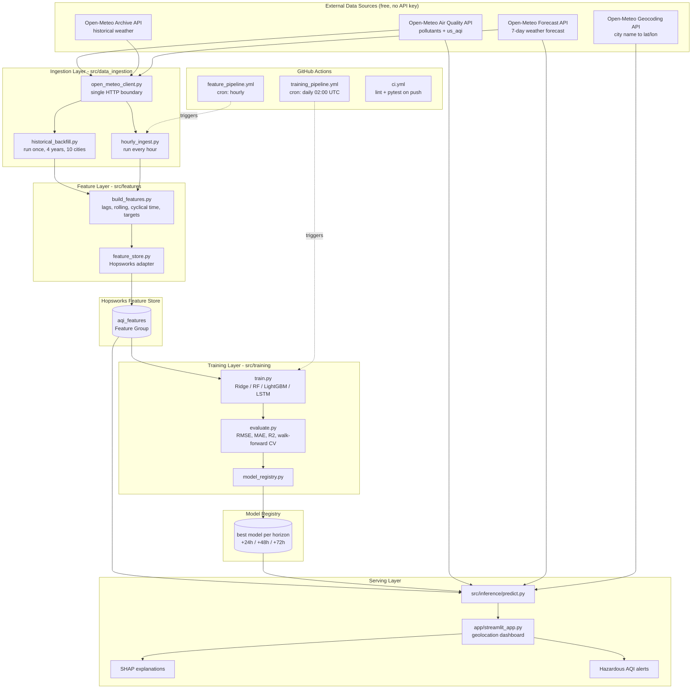

# AQI Predictor — 28-Day Delivery Roadmap

**Owner:** Tahir Hassan · **Program:** 10Pearls Internship
**Day 1:** 27 Jul 2026 · **Day 28:** 23 Aug 2026
**Repo:** https://github.com/AyyanStorm/aqi-predictor
**Budget:** ~2h 15m/day (evenings, 8–11pm PKT), 28 consecutive days
**Mentor syncs:** every Friday. Demo required at **Day 19 (14 Aug)** and **Day 26 (21 Aug)** — treat both as hard deadlines.
**Submission:** GitHub link to the 10Pearls Shine portal. Deliverables = working repo + documentation + project report. No video required.

---

## 1. What You Are Actually Building

A production-shaped ML system with five moving parts that run on a schedule and feed each other:

| Part | Runs | Job |
|---|---|---|
| Feature pipeline | Every hour (GitHub Actions) | Pull raw pollutant + weather data → engineer features → write to Feature Store |
| Historical backfill | Once (manual) | Same logic, but over 4 years of past data → creates the training set |
| Training pipeline | Daily (GitHub Actions) | Read features → train + evaluate models → push best model to Model Registry |
| Inference pipeline | On demand (dashboard) | Read latest features + registered model → predict AQI for +24h, +48h, +72h |
| Dashboard | Always on (Streamlit Cloud) | Detect user location → show current AQI, 3-day forecast, trends, explanations, alerts |

The grader is not scoring "did you get a good RMSE." They are scoring **does this look like an engineer built a system**. Automation, structure, documentation, and honest evaluation carry more weight than model accuracy.

---

## 2. The One Decision That Makes Or Breaks This Project

Open-Meteo's `us_aqi` field is **not an independent measurement**. It is computed deterministically from the pollutant concentrations at the same timestamp using the US EPA breakpoint table. PM2.5 alone usually dictates it.

So this is a trap:

```
X = [pm2_5, pm10, co, no2, so2, o3]  at time t
y = us_aqi                            at time t
→ R² = 0.999
```

That is not machine learning. That is you rediscovering a lookup table. Any reviewer who knows the domain will spot it in thirty seconds, and it is the single most common way this exact assignment gets failed.

**The correct framing — direct multi-horizon forecasting:**

```
Given everything observable at time t,
predict us_aqi at t+24h, t+48h, and t+72h.
```

Three separate target columns → three models (or one multi-output model). Features split into two families:

**Family A — history (known at time t):**
- Current pollutant concentrations and AQI
- Lags: AQI and PM2.5 at t−1h, t−3h, t−6h, t−12h, t−24h, t−48h, t−168h (one week)
- Rolling statistics: 24h mean/max/std, 72h mean, 7-day mean
- Rate of change: `aqi_t − aqi_{t-24}` (the "AQI change rate" the brief asks for)

**Family B — future weather (legitimately known at inference time):**
- Forecast temperature, **wind speed**, **wind direction**, humidity, precipitation, pressure, and boundary-layer height **at the target timestamp**
- Calendar features of the target timestamp: hour, day-of-week, month, is_weekend

Family B is legal because weather forecasts genuinely exist at prediction time. Open-Meteo gives you forecast weather from the same free API. Using them is not leakage — it is exactly how real air-quality forecasting works.

> **Wind is the most important feature in this entire project.** Pollution is emission minus dispersion. Wind speed is dispersion. Your current script only fetches `temperature_2m`. That is the biggest gap in your code today.

**Leakage rule to hold in your head all 28 days:** every feature must be answerable with "yes, I would know this value at the moment I press Predict." If the answer is no, delete the feature.

---

## 3. Your Differentiator: Location-Aware Prediction

You want the dashboard to detect the visitor's location and forecast their city, not a hardcoded one. This is a genuinely good differentiator — but it breaks the naive design, because you cannot pre-train and store a model for every city on Earth.

**Architecture that makes it work: a city-agnostic global model.**

The model must never see "which city is this." It only sees physical and temporal state — pollutant levels, their history, weather, and clock. A model trained that way learns *atmospheric dynamics*, not *Karachi*, and therefore generalises to any coordinate pair.

```
TRAINING (offline, fixed set of 10 Pakistani cities)
  Karachi · Lahore · Islamabad · Faisalabad · Rawalpindi
  Multan · Peshawar · Quetta · Hyderabad · Gujranwala
  → 10 cities × 4 years × hourly ≈ 350,000 rows
  → features contain NO city name, NO latitude, NO longitude

INFERENCE (online, any coordinates on Earth)
  browser geolocation → (lat, lon)
  → Open-Meteo air-quality API (global, no key, any lat/lon)
  → Open-Meteo forecast API (global)
  → build the SAME features with the SAME code
  → global model predicts +24h / +48h / +72h
```

The list spans Pakistan's full range of air-quality regimes — Punjab smog belt (Lahore, Faisalabad, Gujranwala), coastal (Karachi, Hyderabad), arid highland (Quetta), and northern (Islamabad, Peshawar) — so the model sees the full AQI spectrum instead of overfitting to one climate. Scope is deliberately national rather than global: the claim "works for any city in Pakistan" is stronger evidence than a vague global claim, and it is *provable* in the time available.

**Validation strategy that proves the claim:** hold out one entire city — **Sialkot**, which is in no training fold — and report its metrics. If the model performs on a city it has never seen, you have earned the right to say "works anywhere" in your report. Put that table in the README. It is the most impressive thing you can show.

**Location detection — three-tier fallback (build all three, in this order):**

1. **Browser geolocation** — `streamlit-js-eval` calls the JS Geolocation API. Precise, but requires user permission and HTTPS.
2. **IP-based** — `ipapi.co/json` when permission is denied. Free, no key, city-level accuracy.
3. **Manual search** — text box → Open-Meteo Geocoding API (`geocoding-api.open-meteo.com/v1/search`, free, no key). Always works, and it is what the reviewer will use.

No Google Maps API key needed anywhere. Avoid it — it requires a billing card.

**Karachi stays special.** It is your "home city": full hourly pipeline, full 4-year Feature Store backfill, the EDA case study, the SHAP deep-dive. Other cities are training fuel and live inference. This satisfies the brief's Feature-Store requirements *and* your differentiator without conflict.

---

## 4. System Architecture



**Read the arrows carefully.** Training reads only from the Feature Store — never from the API. Inference reads the registry and live API — never retrains. That separation is what makes it an *architecture* instead of a script.

---

## 5. Target Repository Structure

Build this incrementally. Section 7 tells you which day each file appears.

```
aqi-predictor/
├── .github/
│   └── workflows/
│       ├── ci.yml                     # lint + tests on every push
│       ├── feature_pipeline.yml       # hourly ingest → feature store
│       └── training_pipeline.yml      # daily retrain → registry
│
├── src/
│   ├── __init__.py
│   ├── config.py                      # ALL constants + env loading. Single source of truth.
│   │
│   ├── data_ingestion/
│   │   ├── __init__.py
│   │   ├── open_meteo_client.py       # the ONLY file that makes HTTP calls
│   │   ├── historical_backfill.py     # ← your current file, refactored
│   │   └── hourly_ingest.py
│   │
│   ├── features/
│   │   ├── __init__.py
│   │   ├── build_features.py          # raw df → feature df (used by backfill AND inference)
│   │   ├── targets.py                 # y_24, y_48, y_72 construction
│   │   └── feature_store.py           # Hopsworks read/write behind an interface
│   │
│   ├── training/
│   │   ├── __init__.py
│   │   ├── train.py
│   │   ├── evaluate.py                # RMSE / MAE / R² + walk-forward CV
│   │   └── model_registry.py
│   │
│   ├── inference/
│   │   ├── __init__.py
│   │   └── predict.py                 # lat,lon → 3-day forecast
│   │
│   └── utils/
│       ├── __init__.py
│       ├── logger.py                  # structured logging, used everywhere
│       ├── geo.py                     # geocoding + reverse geocoding
│       └── aqi_utils.py               # AQI category, colour, health message
│
├── app/
│   ├── streamlit_app.py               # entrypoint
│   └── components/
│       ├── location_picker.py
│       ├── forecast_cards.py
│       └── charts.py
│
├── notebooks/
│   ├── 01_eda.ipynb
│   ├── 02_feature_analysis.ipynb
│   └── 03_model_experiments.ipynb
│
├── tests/
│   ├── test_features.py
│   ├── test_aqi_utils.py
│   └── test_inference.py
│
├── data/                              # GITIGNORED — never commit data
│   ├── raw/
│   ├── processed/
│   └── models/
│
├── docs/
│   ├── ROADMAP.md                     # this file
│   ├── ARCHITECTURE.md
│   ├── PROJECT_REPORT.md              # final deliverable
│   └── diagrams/
│
├── .env                               # GITIGNORED — real secrets
├── .env.example                       # COMMITTED — placeholder keys
├── .gitignore
├── requirements.txt
├── README.md
└── LICENSE
```

### Structural rules that matter

1. **`src/config.py` is the single source of truth.** No coordinate, date, filename, or threshold is typed twice anywhere in the codebase. When the reviewer asks "how do I change the city list?" the answer must be "one line in config.py."

2. **`build_features.py` is shared by training and inference.** This is the number-one cause of ML systems silently breaking — training-serving skew. If backfill computes a 24h rolling mean one way and the dashboard computes it another way, your predictions are garbage and no error is ever raised. One function, called by both.

3. **All paths are absolute, derived from a `PROJECT_ROOT` constant** in `config.py` (use `pathlib.Path(__file__).resolve().parents[1]`). Your current `to_csv("historical_data.csv")` writes relative to whatever directory you happen to launch from — it will break the moment GitHub Actions runs it.

4. **`open_meteo_client.py` is the only file that touches the network.** Everything else takes a DataFrame in and returns a DataFrame out. That makes the rest of the codebase testable without internet.

5. **`feature_store.py` wraps Hopsworks behind your own function signatures** (`write_features(df)`, `read_features(...)`). If Hopsworks' free tier misbehaves at 11pm on Day 25, you swap in Parquet-on-disk by editing one file instead of rewriting the project.

---

## 6. Tech Stack

| Layer | Choice | Why |
|---|---|---|
| Data source | Open-Meteo (air quality, archive, forecast, geocoding) | Free, no API key, global coverage, 4+ years history. AQICN needs a key and gives thin history. |
| Data handling | pandas, numpy | Standard. |
| Feature Store | Hopsworks Serverless (free tier) | Explicitly named in the brief. Wrapped behind an adapter for safety. |
| Models | scikit-learn (Ridge, RandomForest), LightGBM, TensorFlow/Keras (LSTM) | Ridge = interpretable baseline; LightGBM = will almost certainly win; LSTM = satisfies the "deep learning" bullet. |
| Model Registry | Hopsworks Model Registry, `joblib` local fallback | Brief requirement. |
| Explainability | SHAP (`TreeExplainer`) | Fast and exact for tree models. Brief requirement. |
| Dashboard | Streamlit + Plotly | Pure Python, free hosting, interactive charts. |
| Geolocation | `streamlit-js-eval` → `ipapi.co` → Open-Meteo Geocoding | Three-tier fallback, zero API keys. |
| Orchestration | GitHub Actions (cron) | Free, already where your code lives. Airflow needs a server you do not have. |
| Deployment | Streamlit Community Cloud | Free, deploys straight from the repo, gives a public URL for your submission. |
| Testing | pytest | Lightweight. |
| Secrets | `python-dotenv` locally, GitHub Secrets in CI | Never hardcode a key. |

**Deliberately excluded:** Docker, Airflow, AWS, MLflow, FastAPI. Every one of them is defensible in a real system and every one of them will eat three days you do not have. If a reviewer asks, your answer is the correct engineering answer: *"GitHub Actions met the scheduling requirement at zero operational cost; Airflow would have added a hosting dependency without adding capability at this scale."* That is a better answer than a broken Airflow install.

---

## 7. The 28-Day Plan

Legend: **NEW** = files/folders you create that day · **Commit** = the git commit message you end the day with.

### Phase 0 — Foundation (Days 1–3)

| Day | Date | Theme | NEW | Commit |
|---|---|---|---|---|
| 1 | Mon 27 Jul | Git hygiene, secrets, project skeleton, read your own code line-by-line | `.gitignore`, `requirements.txt`, `README.md`, `src/`, `src/config.py`, `docs/`, `data/`, `.env.example` | `chore: project skeleton, gitignore, config module` |
| 2 | Tue 28 Jul | Python + pandas fluency on real data; DataFrame, index, dtypes, datetime, groupby, resample | `notebooks/01_eda.ipynb` | `feat: initial EDA notebook` |
| 3 | Wed 29 Jul | Refactor ingestion: API client, multi-city loop, wind/humidity/pressure, timezone handling, logging | `src/data_ingestion/open_meteo_client.py`, `src/utils/logger.py`, refactored `historical_backfill.py` | `refactor: modular multi-city ingestion with full weather variables` |

### Phase 1 — Data & Features (Days 4–8)

| Day | Date | Theme | NEW | Commit |
|---|---|---|---|---|
| 4 | Thu 30 Jul | EDA deep-dive: distributions, seasonality, diurnal cycle, correlations, missing data, outliers | (extend notebook) | `docs: EDA findings and visualisations` |
| 5 | Fri 31 Jul | Feature engineering theory: lags, rolling windows, cyclical encoding (sin/cos), change rate, why each one exists | `src/features/build_features.py` | `feat: feature engineering module` |
| 6 | Sat 1 Aug | Target construction + leakage audit; walk-forward split design | `src/features/targets.py` | `feat: multi-horizon target construction` |
| 7 | Sun 2 Aug | Hopsworks account, feature group schema, primary key & event-time design | `src/features/feature_store.py` | `feat: Hopsworks feature store integration` |
| 8 | Mon 3 Aug | Run the full 10-city 4-year backfill into the Feature Store; verify row counts and nulls | — | `feat: complete historical backfill to feature store` |

### Phase 2 — Modeling (Days 9–15)

| Day | Date | Theme | NEW | Commit |
|---|---|---|---|---|
| 9 | Tue 4 Aug | ML fundamentals: bias/variance, overfitting, why time-series CV ≠ random CV; build baselines (persistence, seasonal naive) | `notebooks/03_model_experiments.ipynb`, `src/training/evaluate.py` | `feat: evaluation harness and naive baselines` |
| 10 | Wed 5 Aug | Linear & Ridge regression: the maths, regularisation, scaling, coefficient interpretation | `src/training/train.py` | `feat: ridge regression training pipeline` |
| 11 | Thu 6 Aug | Decision trees → Random Forest: bagging, feature importance, hyperparameters | — | `feat: random forest model` |
| 12 | Fri 7 Aug | Gradient boosting / LightGBM: how boosting differs from bagging, key hyperparameters | — | `feat: lightgbm model, best RMSE so far` |
| 13 | Sat 8 Aug | Walk-forward backtesting, hyperparameter tuning, unseen-city holdout evaluation | — | `feat: walk-forward backtesting and tuning` |
| 14 | Sun 9 Aug | Model Registry: serialisation, versioning, metadata, promotion logic | `src/training/model_registry.py` | `feat: model registry with automated promotion` |
| 15 | Mon 10 Aug | LSTM in Keras: sequences, windowing, why RNNs suit time series; honest comparison vs LightGBM | — | `feat: LSTM baseline for model comparison` |

### Phase 3 — Serving (Days 16–20)

| Day | Date | Theme | NEW | Commit |
|---|---|---|---|---|
| 16 | Tue 11 Aug | Inference pipeline: lat/lon → live fetch → same features → load model → 3-day forecast | `src/inference/predict.py` | `feat: end-to-end inference pipeline` |
| 17 | Wed 12 Aug | Streamlit fundamentals: layout, widgets, caching, session state; first working page | `app/streamlit_app.py` | `feat: streamlit dashboard skeleton` |
| 18 | Thu 13 Aug | Three-tier geolocation + geocoding search; reverse-geocode to a display name | `src/utils/geo.py`, `app/components/location_picker.py` | `feat: automatic user geolocation with fallbacks` |
| 19 | Fri 14 Aug | Plotly charts, AQI colour bands, health messages, hazardous-AQI alerts | `src/utils/aqi_utils.py`, `app/components/charts.py`, `forecast_cards.py` | `feat: interactive charts and hazard alerts` |
| 20 | Sat 15 Aug | SHAP: global + per-prediction explanations rendered in the dashboard | — | `feat: SHAP explainability in dashboard` |

### Phase 4 — Automation (Days 21–24)

| Day | Date | Theme | NEW | Commit |
|---|---|---|---|---|
| 21 | Sun 16 Aug | GitHub Actions concepts: workflows, triggers, cron, secrets; hourly feature pipeline | `.github/workflows/feature_pipeline.yml` | `ci: hourly automated feature pipeline` |
| 22 | Mon 17 Aug | Daily training workflow + automatic model promotion; watch a real run succeed | `.github/workflows/training_pipeline.yml` | `ci: daily automated retraining` |
| 23 | Tue 18 Aug | Deploy to Streamlit Community Cloud; secrets in production; debug the inevitable breakage | — | `chore: production deployment configuration` |
| 24 | Wed 19 Aug | Robustness: retries, timeouts, graceful degradation, structured logs, failure notifications | — | `feat: production error handling and observability` |

### Phase 5 — Proof & Polish (Days 25–28)

| Day | Date | Theme | NEW | Commit |
|---|---|---|---|---|
| 25 | Thu 20 Aug | pytest: unit tests for features, AQI utils, inference; CI workflow | `tests/*`, `.github/workflows/ci.yml` | `test: unit test suite and CI` |
| 26 | Fri 21 Aug | README with architecture diagram, screenshots, setup instructions, results table | `README.md` (full rewrite), `docs/ARCHITECTURE.md` | `docs: comprehensive README and architecture` |
| 27 | Sat 22 Aug | Project report: problem, approach, experiments, results, limitations, future work | `docs/PROJECT_REPORT.md` | `docs: final project report` |
| 28 | Sun 23 Aug | Full review, README screenshots, verify every scheduled run is green, tag and submit to Shine portal | — | `chore: v1.0.0 final submission` |

### Built-in slack

Days 4, 11, 12 and 15 are lighter than they look. If you fall behind, the safe cuts in priority order are: **(1)** LSTM on Day 15 — LightGBM will win anyway; **(2)** the deep SHAP dashboard integration on Day 20 — keep a static feature-importance plot instead; **(3)** reduce from 10 training cities to 5. Never cut: automation (Days 21–22), deployment (Day 23), or documentation (Days 26–27). Those are what the certificate is actually judged on.

---

## 7a. Weekly Sunday Review

Every Sunday (Days 7, 14, 21, 28), before starting that day's new topics:

1. **Full file walkthrough** — revisit every file created so far in the whole project (not just that week), one by one: what it does, why it exists, how it connects to the others. Cumulative, not just recent additions — the goal is that by Day 28 you can explain the entire codebase file by file, unprompted.
2. **Progress check vs. this roadmap** — compare what's actually been built against the Day-by-Day plan (Section 7). Flag anything behind schedule and decide then whether to cut scope (Section 7's slack list) or catch up.

---

## 8. Git Workflow (for a first-timer)

You are working solo, so keep it simple but disciplined.

**Branch model:** `main` is always deployable. Do all work on `main` for Days 1–5 while you build muscle memory, then switch to short feature branches from Day 6 onward:

```
git checkout -b feat/feature-engineering
# ... work, commit as you go ...
git push -u origin feat/feature-engineering
# open a Pull Request on GitHub, review your own diff, merge
```

Why bother when you are alone? Because the reviewer will open your Insights → Network graph. A repo with branches, PRs, and 28 days of daily commits reads as *engineer*. A repo with one commit titled "final" reads as *rushed*.

**Commit convention** (Conventional Commits — use it from Day 1):

```
feat:     new capability
fix:      bug fix
refactor: restructure without behaviour change
docs:     documentation
test:     tests
chore:    tooling, config, dependencies
ci:       pipeline changes
```

**Non-negotiable rules:**

- **Commit every single day.** The contribution graph is visible evidence of consistent work. A 28-day unbroken streak is a genuine differentiator.
- **Never commit `.env`, `.venv/`, `data/`, `*.csv`, `*.pkl`, `.cache.sqlite`, or `.idea/`.**
- Commit messages describe *why*, not *what*. `git diff` already shows what.
- Tag the final state: `git tag -a v1.0.0 -m "Final submission" && git push --tags`.

---

## 9. Risk Register

| # | Risk | Impact | Likelihood | Mitigation |
|---|---|---|---|---|
| R1 | Secrets (`.env`) already pushed to a public repo | High | **Medium — verify on Day 1** | `git ls-files` to check; if committed, rotate the key immediately and purge from history |
| R2 | Target leakage — predicting AQI from same-hour pollutants | **Critical** | High if unaware | Section 2 target design; explicit leakage audit on Day 6 |
| R3 | Training-serving skew — features built differently in backfill vs dashboard | High | High | Single shared `build_features.py`; Day 25 test asserts both paths produce identical output |
| R4 | Hopsworks free-tier limits or outage | High | Low–Medium | Adapter pattern in `feature_store.py`; Parquet fallback ready |
| R5 | Open-Meteo rate limiting during the 10-city backfill | Medium | Medium | `requests-cache` (already in your code) + retry with backoff + sequential city loop with sleep |
| R6 | GitHub Actions cron does not fire on schedule | Medium | **Medium — this is common** | Also add `workflow_dispatch` so you can trigger manually; verify runs on Day 22 and again on Day 28 |
| R7 | Streamlit Cloud cold-starts or times out loading the model | Medium | Medium | `@st.cache_resource` for the model, `@st.cache_data` for API calls; keep model file small |
| R8 | Browser geolocation blocked (no HTTPS / permission denied) | Medium | High | Three-tier fallback (Section 3) — manual city search always works |
| R9 | Falling behind schedule | High | Medium | Cut list in Section 7. Decide by Day 20, not Day 27. |
| R10 | Model performs poorly at +72h | Low | **High — this is expected** | Report it honestly. Forecast skill decaying with horizon is a real, correct finding. Reviewers respect a documented limitation far more than a suspiciously perfect number. |

---

## 10. Definition of Done (verify on Day 28)

- [ ] Feature pipeline runs hourly on GitHub Actions — green runs visible in the Actions tab
- [ ] Training pipeline runs daily — green runs visible
- [ ] Feature Store contains ≥ 4 years × 10 cities of engineered features
- [ ] Model Registry contains versioned models for all three horizons
- [ ] Dashboard live on a public Streamlit URL
- [ ] Dashboard auto-detects location and forecasts AQI for +24h / +48h / +72h
- [ ] RMSE, MAE and R² reported per horizon, versus a naive baseline
- [ ] Unseen-city holdout results published — proves the "works anywhere" claim
- [ ] SHAP explanations visible in the dashboard
- [ ] Hazardous-AQI alert triggers above threshold
- [ ] EDA notebook committed with findings written up
- [ ] README: architecture diagram, screenshots, setup steps, results table
- [ ] `docs/PROJECT_REPORT.md` complete
- [ ] Test suite passes in CI
- [ ] No secrets in git history
- [ ] Commits on all 28 days
- [ ] Repo tagged `v1.0.0`
